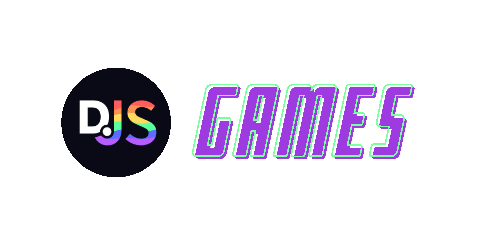

import Callout from 'nextra-theme-docs/callout'
import Image from 'next/image'

# djs-games


A discord.js Games Package with Who's that Pokemon, ConnectFour, Snake, Rock paper scissors, guessTheNumber, tictactoe , fast type, hangman and other games!

## Installation

```js
npm install djs-games
```

<Callout>
  djs-games requires discord.js version 13+ and a node version of 16+ to work.
</Callout>
<br />
<a href="https://www.npmjs.com/package/djs-games">
  
</a>
### Example usage

```
USE ACCORDING TO YOUR COMMAND HANDLER
```

## Who's that Pokemon

```js
const { Pokemon } = require('djs-games')
const game = new Pokemon({
  message: message,
  token: 'dagpi-token-here', // Get Your Api Token at https://dagpi.xyz/dashboard
  winMessage: 'You Win!',
  loseMessage: 'You Lose!',
  wrongGuess: 'Wrong Guess!',
  stopCommand = 'stop',
  maxAttempts: 10,
})
game.start()
```

## Guess The Logo

```js
const { GTL } = require('djs-games')
const game = new GTL({
  message: message,
  token: 'dagpi-token-here', // *Required!! Get Your Api Token at https://dagpi.xyz/dashboard
  stopCommand: 'stop', // *Required!!
  winFooter: 'You Win!', // Set The Footer of the win message
  winColor: 'GREEN', // The embed color of the win message
  loseFooter: 'You Lose!', // Set The Footer of the lose message
  loseColor: 'RED', // The embed color of the lose message
  questionFooter: 'Guess the Logo!', // Set The Footer of the question message
  questionColor: 'BLUE', // The embed color of the question message
  maxAttempts: 5, //
})
game.start()
```

## Guess The Flag

```js
const { GTF } = require('djs-games')
const game = new GTF({
  message: message,
  token: 'dagpi-token-here', // *Required!! Get Your Api Token at https://dagpi.xyz/dashboard
  stopCommand: 'stop', // *Required!!
  winFooter: 'You Win!', // Set The Footer of the win message
  winColor: 'GREEN', // The embed color of the win message
  loseFooter: 'You Lose!', // Set The Footer of the lose message
  loseColor: 'RED', // The embed color of the lose message
  questionFooter: 'Guess the Flag!', // Set The Footer of the question message
  questionColor: 'BLUE', // The embed color of the question message
  winMessage: 'You Win!', // Set The Win Message
  loseMessage: 'You Lose!', // Set The Lose Message
  maxAttempts: 5, //
  wrongGuess: 'Wrong Guess!', // Set The Wrong Guess Message
})
game.start()
```

## Tic Tac Toe

```js
const { TicTacToe } = require('djs-games')
const game = new TicTacToe({
  message: message,
  xEmote: '❌', // The Emote for X
  oEmote: '0️⃣', // The Emote for O
  xColor: 'PRIMARY',
  oColor: 'PRIMARY', // The Color for O
  embedDescription: 'Tic Tac Toe', // The Description of the embed
})
game.start()
```

<Callout emoji="❄">
  {' '}
  AVAILABLE COLORS: | BLURPLE: PRIMARY | GREY: SECONDARY | RED: DANGER | GREEN:
  SUCCESS
</Callout>

## ConnectFour

```js
const { ConnectFour } = require('djs-games')
const game = new ConnectFour({
  message: message,
  player1: '🔴',
  player2: '🟡',
})
game.start()
```

## Snake

```js
const { Snake } = require('djs-games')
const game = new Snake({
  message: message,
  buttons: true, // If you want to use buttons || False if you want to use reactions
  snake: '🟩',
  apple: '🍎',
  embedColor: 'RANDOM',
  leftButton: '◀',
  rightButton: '▶',
  upButton: '▲',
  downButton: '▼',
})
game.start()
```

## RockPaperScissors

```js
const { RockPaperScissors } = require('djs-games')
const game = new RockPaperScissors({
  message: message,
})
game.start()
```

## GuessTheNumber

```js
const { GuessTheNumber } = require('djs-games')
const game = new GuessTheNumber({
  message: message,
  wrongGuess: 'Wrong Guess!',
  correctGuess: 'Correct Guess!',
})
game.start()
```

## Fast Type

```js
const { FastType } = require('djs-games')
const game = new FastType({
  message: message,
})
game.start()
```

## Hangman

```js
const { Hangman } = require('djs-games')
const game = new Hangman({
  message: message,
  theme: 'coding', // 'sport', 'coding', 'nature', 'popular game', 'phone brand', 'color', 'camping', 'music instrument'
  hangManHat: '🎓',
  hangManHead: '🙉',
  hangManShirt: '👚 ',
  hangManPants: '👖 ',
  hangManBoots: '👟👟',
})
game.start()
```

## Example Bot

[Checkout This Repository for a full example bot.](https://github.com/GizmolabAI/DiscordBot-GL/)

<Callout>
  {' '}
  Give [**djs-games**](https://github.com/GizmolabAI/djs-games) a star on
  github!
</Callout>

### Coffee??

If you liked this package, you can Support me by Buying Me A coffee

<a href="https://www.buymeacoffee.com/g1zmo">
  
</a>
